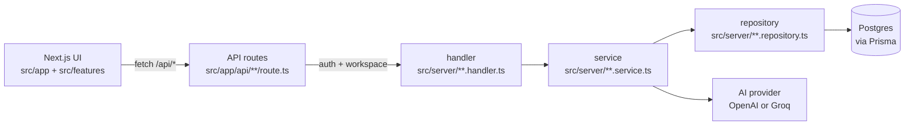
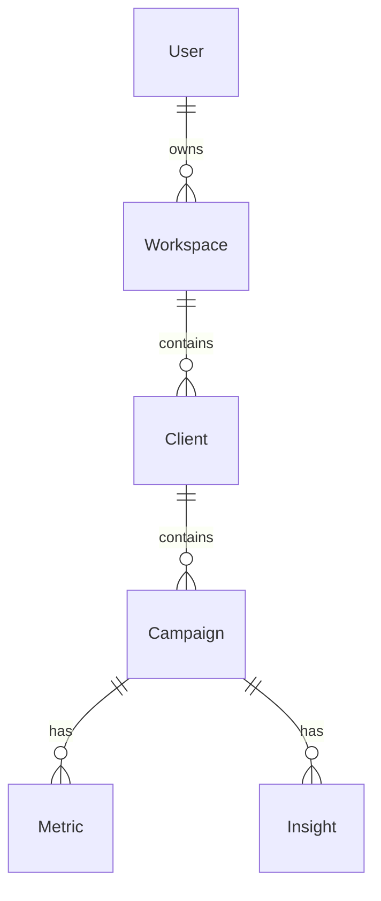

# Marketiqo Architecture

Marketiqo is an AI-powered campaign tracker built on **Next.js App Router** with a **layered server architecture** and a **feature-based frontend**. The core idea is:

- **Frontend**: `src/features/**` owns UI + hooks + API wrappers.
- **API layer**: `src/app/api/**/route.ts` stays thin (auth, workspace selection, input parsing).
- **Server layer**: `src/server/<domain>/**` follows `handler → service → repository → Prisma`.
- **Data**: PostgreSQL via **Prisma** (Neon adapter) with **workspace scoping**.
- **Auth**: **Clerk** protects routes and supplies the `clerkUserId` used for tenancy.
- **AI**: a small abstraction over **OpenAI** or **Groq** for insight generation.

---

## Product overview (conceptual model)

At an app level, Marketiqo models:

- **Users** (authenticated via Clerk)
- **Workspaces** (a user can have multiple; one can be a demo workspace)
- **Clients** (workspace-scoped)
- **Campaigns** (belong to a client)
- **Metrics** (time-series daily points per campaign)
- **Insights** (AI- or rule-generated text attached to a campaign)

The dashboard aggregates campaign + metric signals and can request AI-generated briefs.

---

## Repository structure (key directories)

## Project structure (at a glance)

This is the “where does what live?” map. It’s intentionally high-level so it stays accurate as the codebase grows.

```text
docs/
  ARCHITECTURE.md            # End-to-end system architecture (this doc)

prisma/
  schema.prisma              # Data model (User/Workspace/Client/Campaign/Metric/Insight)
  migrations/                # Prisma migrations (deployed in CI/build)

src/
  app/                       # Next.js App Router (pages/layouts + API routes)
    (auth)/                  # Public auth pages (Clerk)
    (dashboard)/             # Authenticated product pages
    api/                     # HTTP endpoints (thin: auth + workspace + delegate)

  features/                  # Frontend domain modules (UI + hooks + api wrappers)
    app-shell/               # Sidebar/header/layout chrome
    clients/                 # Client screens, hooks, /api wrappers, schemas/types
    campaigns/               # Campaign screens, hooks, /api wrappers, schemas/types
    dashboard/               # Dashboard UI components
    demo/                    # Demo onboarding UI
    settings/                # Settings UI (e.g. data reset)

  server/                    # Backend domain logic (handler → service → repository)
    db/                      # Prisma singleton client
    workspace/               # Workspace resolution helpers (demo vs real)
    clients/                 # Client domain handler/service/repository
    campaigns/               # Campaign domain handler/service/repository (+ schemas)
    dashboard/               # Dashboard domain handler/service/repository
    settings/                # Data reset / workspace maintenance logic
    demo/                    # Demo seed service + curated demo data

  components/ui/             # Shared shadcn/ui primitives
  lib/                       # Shared utilities (e.g. AI client wrapper)
  middleware.ts              # Clerk auth middleware + redirects
```

### Frontend (Next.js App Router)

- `src/app/`
  - Route groups:
    - `src/app/(auth)/...` public auth pages
    - `src/app/(dashboard)/...` authenticated app pages
  - API routes:
    - `src/app/api/**/route.ts`
  - Global app scaffolding:
    - `src/app/layout.tsx` (root providers, global CSS)
    - `src/middleware.ts` (Clerk middleware + redirects)

### Frontend feature modules

- `src/features/`
  - `app-shell/` layout chrome (sidebar/header) used by dashboard pages
  - `campaigns/` campaigns UI + hooks + `/api/campaigns` wrappers
  - `clients/` client UI + hooks + `/api/clients` wrappers
  - `dashboard/` dashboard UI composition/loading skeletons
  - `demo/` demo onboarding/overlay UI
  - `settings/` settings UI (e.g. data reset)

### Backend domain modules (server-side)

- `src/server/`
  - `db/client.ts` Prisma singleton using Neon adapter
  - `workspace/resolve-workspace.ts` workspace selection helpers
  - Domain modules:
    - `campaigns/` `*.handler.ts`, `*.service.ts`, `*.repository.ts`, schemas
    - `clients/` `*.handler.ts`, `*.service.ts`, `*.repository.ts`
    - `dashboard/` `*.handler.ts`, `*.service.ts`, `*.repository.ts`
    - `settings/` `*.handler.ts`, `*.service.ts`, `*.repository.ts`
    - `demo/` demo data and demo seeding service

### Shared UI primitives

- `src/components/ui/` shadcn/ui components

---

## Runtime architecture (request/response flow)

### End-to-end flow for a typical user request

1. **Client loads UI** in `src/app/(dashboard)/**` composed from `src/features/**`.
2. Feature code calls a **feature API wrapper** (e.g. `src/features/campaigns/api/campaigns.api.ts`).
3. The wrapper calls **Next.js API routes** under `src/app/api/**`.
4. API route:
   - authenticates with Clerk (`auth()`),
   - resolves the active workspace (`resolveWorkspaceId`),
   - delegates to a server handler.
5. Handler calls a **service** which:
   - enforces business rules,
   - orchestrates repository calls,
   - optionally calls the AI provider.
6. Repository performs **Prisma queries** scoped by workspace.
7. Handler returns a `NextResponse.json(...)` with appropriate status.

### Diagram (high level)



---

## Authentication & access control (Clerk)

### Route protection

`src/middleware.ts` uses Clerk middleware to:

- treat `/sign-in`, `/sign-up`, `/sso-callback` as public routes
- redirect `/` to:
  - `/dashboard` if authenticated
  - `/sign-in` otherwise
- redirect any non-public route to `/sign-in` when unauthenticated

### Identity in the database

The primary identity link is:

- Clerk user id (`clerkUserId`) stored in `User.clerkUserId` (Prisma model `User`)

The dashboard layout (`src/app/(dashboard)/layout.tsx`) syncs the logged-in Clerk user into the DB on first visit and creates a default workspace if needed.

---

## Multi-tenancy & workspace resolution

### Data scoping strategy

Workspace is the tenancy boundary. Most read/write operations must be scoped to the active workspace.

Key helpers live in `src/server/workspace/resolve-workspace.ts`:

- `resolveWorkspaceId(clerkUserId)`
  - returns the **demo workspace** while demo is active
  - otherwise returns the first “real” workspace
- `getRealWorkspaceId(clerkUserId)`
  - returns the first “real” workspace (used for write paths that must avoid demo)

### Demo mode

The product supports a “demo workspace” for onboarding:

- `User.demoClearedAt` indicates whether the demo environment has been cleared.
- Demo seeding occurs in `src/server/demo/demo-seed.service.ts` using curated data from `src/server/demo/demo-seed.data.ts`.
- Settings data reset (`src/server/settings/settings.service.ts`) handles:
  - clearing + deleting the demo workspace and marking `demoClearedAt`
  - or clearing the real workspace data if demo is already cleared

---

## Backend architecture (handler → service → repository)

### Responsibilities

- **API route** (`src/app/api/**/route.ts`)
  - authenticate with Clerk
  - resolve workspace context
  - parse request params/body (often using Zod)
  - call a handler and return its response

- **Handler** (`src/server/<domain>/*.handler.ts`)
  - convert service results and errors into HTTP response objects
  - keep HTTP concerns localized (status codes, response JSON)
  - avoid Prisma queries and business rules

- **Service** (`src/server/<domain>/*.service.ts`)
  - business logic (validation, orchestration, response shaping)
  - AI calls and result normalization/fallback logic
  - domain-specific computations (sorting, aggregation, deduping)

- **Repository** (`src/server/<domain>/*.repository.ts`)
  - Prisma queries only
  - enforce workspace scoping in query filters
  - use transactions for multi-step deletes/updates

### Current exceptions (legacy direct-Prisma)

Some parts of the codebase still query Prisma directly outside repositories:

- `src/app/(dashboard)/layout.tsx` syncs the Clerk user + creates a default workspace.
- Some API routes still query Prisma directly (notably demo endpoints and the legacy dashboard stats endpoint).

As these areas are extended, the intended direction is to migrate them toward the same domain chain (`route → handler → service → repository`) to keep business logic and data access consistent and testable.

### Example: dashboard AI brief

- API: `POST /api/dashboard/insights` → `src/app/api/dashboard/insights/route.ts`
- Handler: `handleGeneratePortfolioAiBrief` → `src/server/dashboard/dashboard.handler.ts`
- Service: `generatePortfolioAiBrief` → `src/server/dashboard/dashboard.service.ts`
  - fetches context via repository
  - calls AI provider
  - validates/normalizes output and falls back when needed
- Repository: `getDashboardAiContext` → `src/server/dashboard/dashboard.repository.ts`

---

## AI architecture (OpenAI / Groq)

### Provider abstraction

`src/lib/chat-llm.ts` provides:

- `resolveAiProvider()` → `"groq"` by default, or `"openai"` if `AI_PROVIDER=openai`
- `chatModel()` → default model per provider unless `AI_CHAT_MODEL` is set
- `getChatClient()` → returns a minimal client shaped like `client.chat.completions.create(...)`

### Insight generation patterns

The codebase uses two common patterns:

- **Short “quick insight”** (single sentence) for a campaign:
  - implemented in `src/server/campaigns/campaigns.service.ts`
  - persists the latest “summary” insight by replacing existing summary rows

- **Structured JSON briefs** (portfolio-level):
  - implemented in `src/server/dashboard/dashboard.service.ts`
  - uses `response_format: { type: "json_object" }`
  - normalizes categories/severities and clamps text lengths
  - falls back to deterministic brief generation when AI fails

### Environment variables (AI)

- `AI_PROVIDER` (optional): `groq` (default) or `openai`
- `AI_CHAT_MODEL` (optional): override model name
- `GROQ_API_KEY` (required if provider is groq/default)
- `OPENAI_API_KEY` (required if provider is openai)

---

## Data architecture (Prisma + Postgres)

### Prisma setup

- Schema: `prisma/schema.prisma`
- Client: `src/server/db/client.ts`
  - Prisma singleton cached on `globalThis` for dev
  - Neon adapter expects `DATABASE_URL`

### Core tables and relationships

At a high level:



### Workspace scoping in queries

Repositories typically scope by workspace using relation filters, e.g.:

- campaigns: `where: { client: { workspaceId } }`
- metrics/insights: `where: { campaign: { client: { workspaceId } } }`

---

## Frontend architecture (feature-based)

### Composition model

Dashboard pages under `src/app/(dashboard)/**` compose feature components from `src/features/**`.

Common patterns:

- Feature API wrappers (`src/features/*/api/*.api.ts`) call `/api/**`.
- Feature hooks (`src/features/*/hooks/*`) manage loading/caching state for screens.
- Feature components render UI using shared shadcn/ui primitives in `src/components/ui/**`.

### App shell

The authenticated area uses an app shell component:

- `src/features/app-shell/AppLayout.tsx` is used by `src/app/(dashboard)/layout.tsx`
  - sidebar + header chrome
  - responsive behavior is expected (mobile drawer vs desktop rail)

---

## Error handling & response shape

- Handlers typically:
  - return `200/201` with `{ ... }` bodies on success
  - map domain errors (e.g. “not found”) to `404`
  - return `500` for unexpected errors
- Services throw `Error("...")` for expected failure cases; handlers translate those.
- AI flows should always have a **safe fallback** for reliability (dashboard brief does).

---

## Security posture (current state)

- **Authentication**: enforced at middleware + API route level via Clerk.
- **Authorization**: enforced primarily by **workspace scoping** in repository queries.
- **Server-only secrets**: API keys and `DATABASE_URL` are read from env and never sent to clients.

Gaps to be aware of as the product grows:

- Formalize a consistent “authorization boundary” for all write operations (some operations use demo/real workspace rules).
- Add rate limits and request validation on AI generation endpoints if exposing publicly.
- Add structured logging without leaking sensitive content (especially AI prompts).

---

## Deployment & environments

### Local development

Key commands (from `package.json`):

- `npm run dev` (Next.js dev server)
- `npm run build` runs `prisma generate`, `prisma migrate deploy`, then `next build`

### Required environment variables (minimum)

- `DATABASE_URL`
- `NEXT_PUBLIC_CLERK_PUBLISHABLE_KEY`
- `CLERK_SECRET_KEY`
- plus AI provider key(s) depending on configuration

---

## How to extend the system (conventions)

### Adding a new domain (example: “reports”)

- **API route**: `src/app/api/reports/route.ts`
  - `auth()` + `resolveWorkspaceId()` + delegate to handler
- **Server domain**:
  - `src/server/reports/reports.handler.ts`
  - `src/server/reports/reports.service.ts`
  - `src/server/reports/reports.repository.ts`
- **Frontend**:
  - `src/features/reports/` with `api/`, `hooks/`, `components/`, `types`

### Rule of thumb

- Put persistence in repositories, orchestration in services, HTTP in handlers, and UI behavior in feature modules.

